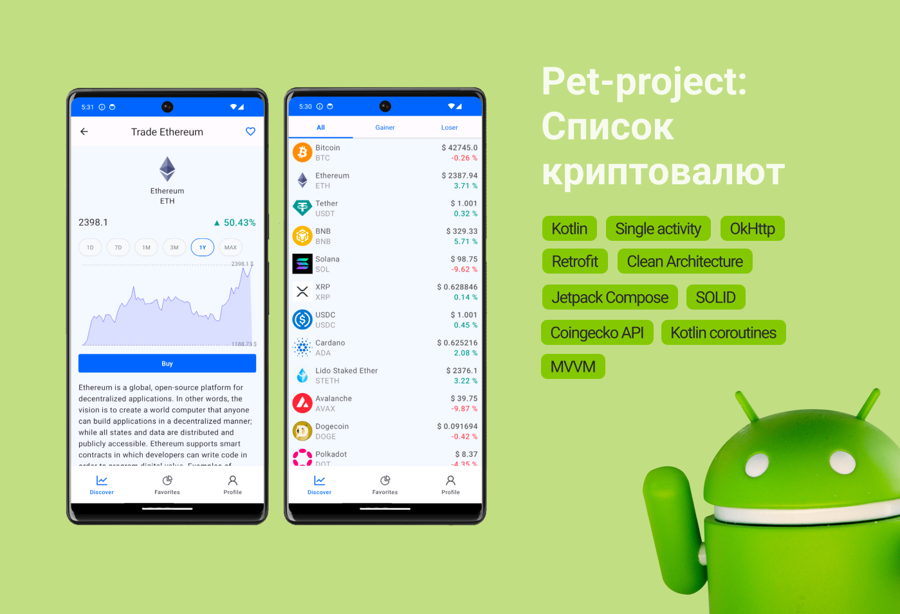

# Список криптовалют



Данный проект представляет собой приложение для отображения списка криптовалют с краткой информацией о каждой из них. Информация о криптовалютах загружается из открытых источников с использованием Coingecko API.

## Стек технологий

В проекте используются следующие технологии, библиотеки и инстуременты:

- **Kotlin:** Основной язык программирования для Android-разработки.
- **Single activity:** Используется единственная активность для управления фрагментами.
- **MVVM (Model-View-ViewModel):** Архитектурный шаблон для разделения логики приложения на модель, представление и модель представления.
- **Clean Architecture:** Четкое разделение бизнес-логики и уровня данных.
- **Jetpack Compose:** Современный фреймворк для создания пользовательских интерфейсов.
- **Retrofit:** Библиотека для выполнения HTTP-запросов к API.
- **OkHttp:** HTTP-клиент для обработки сетевых запросов.
- **Kotlin Coroutines:** Для управления асинхронными операциями.
- **Coingecko API:** Источник данных о криптовалютах.

## Описание

Приложение предоставляет пользователю возможность просматривать информацию о различных криптовалютах, такую как название, символ, текущая цена и процент изменения цены за 24 часа. Есть возможность добавлять криптовалюты в избранные и смотреть график изменения цены

## Инструкции по установке

1. Склонируйте репозиторий на свой компьютер:

```
$ git clone https://github.com/NuriG/CryptocurrencyApp.git
```

2. Откройте проект в Android Studio.

3. Запустите приложение на эмуляторе или устройстве.

## Вклад в проект

Если у вас есть предложения по улучшению проекта или вы хотите внести свой вклад, не стесняйтесь создавать pull request или сообщать об ошибках через Issues.

## Лицензия

Проект распространяется свободно. Вы можете спокойно использовать его в своих проектах в любых целях.

---

**© 2023 Nurgali Shavaliev**
